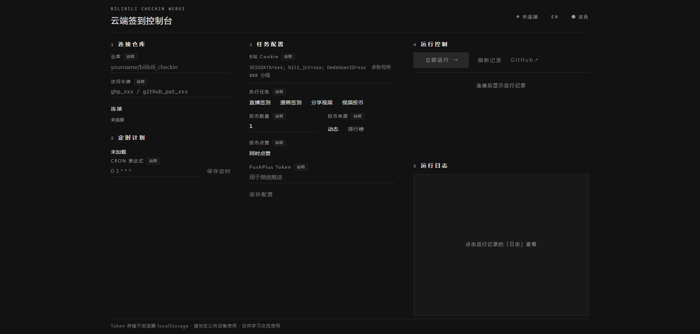
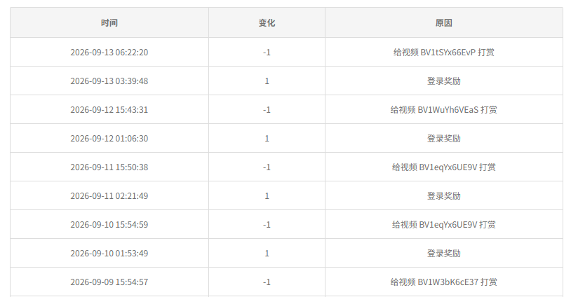

# Bilibili Checkin WebUI

基于 [dangks/bilibili_checkin](https://github.com/dangks/bilibili_checkin) 项目的二开版本，添加前端可视化操作，支持查看每日任务的运行日志和仓库配置可视化修改

> 仅供学习交流使用

## 目录

- [界面预览](#界面预览)
- [功能](#功能)
- [技术栈](#技术栈)
- [目录结构](#目录结构)
- [配置参考](#配置参考)
- [快速开始](#快速开始)
- [WebUI 控制台用法](#webui-控制台用法)
- [Cookie 获取（含自动刷新）](#cookie-获取含自动刷新)
- [本地运行](#本地运行)
- [CRON 说明](#cron-说明)
- [常见问题](#常见问题)
- [安全与免责](#安全与免责)
- [License](#license)

## 界面预览





## 功能

- **一键签到**：直播签到（`live_sign`）、漫画签到（`manga_sign`）
- **每日任务**：分享视频（`share_video`）、视频投币（`add_coin`，0–5 枚）；观看视频为固定任务，始终执行
- **多账号**：`BILIBILI_COOKIE` / `BILIBILI_REFRESH_TOKEN` 按 `###` 分隔
- **Cookie 保活**：官方刷新链 `info→refresh→confirm`，`ac_time_value` 自动续期并回写 Secrets
- **投币策略**：动态 / 排行榜选片，超上限、硬币不足自动跳过，可选同时点赞
- **推送**：PushPlus 微信推送 Markdown 任务报告（含刷新状态）
- **WebUI 控制台**（`console/`）：连接仓库、保存配置、改 CRON、手动触发、查看 runs / 日志，中英双语、深浅主题、移动端适配
- **日志脱敏**：用户名 / UID 打码，北京时间输出

## 技术栈

- **任务端**：Python 3.11、`requests`、`loguru`、`pycryptodome`（见 `requirements.txt`）
- **定时端**：GitHub Actions（`ubuntu-22.04`，见 `.github/workflows/Bilibili_DailyCheckin.yml`）
- **控制台**：原生 HTML / CSS / JS，直调 GitHub REST API，`libsodium-wrappers` 加密 Secrets

## 目录结构

```text
.
├── main.py                                     # 程序入口：多账号调度、自动刷新、投币与推送
├── bilibili.py                                 # B 站任务 API 封装
├── cookie_refresh.py                           # Web Cookie 官方刷新链(info/refresh/confirm)
├── push.py                                     # 报告格式化与 PushPlus 推送
├── requirements.txt                            # Python 依赖声明
├── .github/workflows/Bilibili_DailyCheckin.yml  # 定时与手动触发流程(含刷新回写)
└── console/
    ├── index.html                              # 五区布局的控制台页面
    ├── app.js                                  # GitHub API 交互与前端逻辑
    ├── sodium-core.js / sodium.js              # 本地加密组件（Secrets 加密，免 CDN）
    ├── style.css                               # 主题与移动端适配样式
    └── theme.js                                # 主题初始化脚本
```

## 配置参考

所有配置只涉及 4 个 Secret 与 4 个 Variable，名称、默认值均与代码一致。配置方式二选一，效果完全相同：

1. **WebUI 控制台（推荐）**：在页面填写后保存，自动写入仓库，见「[WebUI 控制台用法](#webui-控制台用法)」
2. **GitHub 手动配置**：仓库 `Settings → Secrets and variables → Actions`，按下表添加

### Secrets（密文，只可覆盖、不可读取）

| Secret | 必填 | 说明 |
| :--- | :---: | :--- |
| `BILIBILI_COOKIE` | 是 | B 站 Cookie，需含 `SESSDATA`、`bili_jct`、`DedeUserID`<br>多账号用 `###` 分隔 |
| `BILIBILI_REFRESH_TOKEN` | 否（强烈推荐） | 即浏览器 `localStorage` 的 `ac_time_value`，多账号用 `###` 与 Cookie 一一对应<br>配置后任务前自动检查刷新，刷新后自动回写 `BILIBILI_COOKIE`+`BILIBILI_REFRESH_TOKEN`；留空则不自动刷新，3天左右就会过期 |
| `PUSH_PLUS_TOKEN` | 否 | [pushplus.plus](https://www.pushplus.plus) Token，不填则不推送 |
| `COOKIE_REFRESH_PAT` | 否（自动回写用） | 用于刷新后自动回写 Secrets 的 PAT：经典 Token 勾 `repo`，或细粒度给 `Secrets` 读写<br>不配也能跑任务和刷新，只是新 Cookie 无法自动写回，需按日志手动更新 |

> 用 WebUI 保存时，Secret 留空表示不修改原值

### Variables（明文）

| 变量 | 默认值 / 取值 | 说明 |
| :--- | :--- | :--- |
| `TASK_CONFIG` | `live_sign` `manga_sign` `share_video` `add_coin`<br>逗号分隔 | 要执行的任务，删除或留空执行全部默认任务，未知任务名会被忽略 |
| `COIN_ADD_NUM` | `1`（`0`–`5`） | 每日投币数量，`0` 跳过投币<br>实际投币数取「配置值、硬币余额、5」的最小值，硬币不足自动跳过 |
| `COIN_SELECT_LIKE` | `1`（`1` 是 / `0` 否） | 投币时是否同时点赞 |
| `COIN_VIDEO_SOURCE` | `dynamic`<br>（`dynamic` 动态 / `ranking` 排行榜） | 投币目标来源 |

> 观看视频为固定任务，不受 `TASK_CONFIG` 控制，每次都会执行

## 快速开始

### 1. Fork / 导入本仓库到你的 GitHub

### 2. 配置

按「[配置参考](#配置参考)」完成 Secrets 与 Variables，推荐直接用 WebUI 控制台，无需进 GitHub 手动添加

### 3. 运行

- 自动：默认 `cron: '0 3 * * *'`（UTC，即北京时间每天 11:00）
- 手动：Actions 页 → `Bilibili Checkin WebUI` → `Run workflow`

## WebUI 控制台用法

打开方式：将 `console/` 目录部署到 Cloudflare Pages / GitHub Pages 等静态托管后访问使用

1. **连接仓库**：填 `owner/repo` + PAT
   - 经典 Token：勾 `repo`
   - Fine-grained：给 `Actions`、`Variables`、`Secrets`、`Contents` 读写权限
   - Token 只存本机 `localStorage`，勿在公共设备使用
2. **定时计划**：读取 workflow 文件中的 `cron`，显示 UTC + 换算北京时间，保存即提交一次 commit
3. **任务配置**：填写 Cookie / RefreshToken / PushPlus Token，勾选任务、投币数 / 来源 / 点赞后点保存配置，字段含义见「[配置参考](#配置参考)」
   - Cookie / RefreshToken / PushPlus Token 写入 Secrets，留空 = 不修改
   - 任务与投币设置写入 Variables
4. **运行控制**：`立即运行`（`workflow_dispatch`）、`刷新记录`、跳转 GitHub
5. **运行日志**：点某条运行的 `日志`，拉取 jobs 日志（默认取最后 1200 行，`ERROR` / `WARNING` 高亮）

## Cookie 获取（含自动刷新）

1. 无痕窗口登录 `bilibili.com`（推荐小号，登录后不要再用该窗口手动刷B站，避免双端互踢）
2. `F12` → Network → 刷新页面 → 任一请求 → Request Headers → 复制 `Cookie`
3. 确认包含 `SESSDATA`、`bili_jct`、`DedeUserID`
4. `F12` → Application → Local Storage → `https://www.bilibili.com` → 复制 `ac_time_value`，填入 `BILIBILI_REFRESH_TOKEN`（多账号用 `###` 与 Cookie 一一对应）
5. 取完关闭无痕窗口即可。之后每天任务前会自动 `info→refresh→confirm`，刷新后 Actions 自动回写 Secrets（需配 `COOKIE_REFRESH_PAT`），本地运行需手动回填

> 原理见 `cookie_refresh.py` 与 `pskdje/bilibili-API-collect#cookie_refresh`：只有 `refresh=true` 时才刷新，不强刷；`-101/86095` 表示需手动重登。

## 本地运行

```bash
pip install -r requirements.txt
# Windows PowerShell 示例
$env:BILIBILI_COOKIE="SESSDATA=xxx; bili_jct=xxx; DedeUserID=xxx"
$env:BILIBILI_REFRESH_TOKEN="ac_time_value_xxx"  # 可选，配了才自动刷新，多账号用 ### 分隔
$env:TASK_CONFIG="live_sign,manga_sign,share_video,add_coin"
$env:COIN_ADD_NUM="1"
$env:COIN_SELECT_LIKE="1"
$env:COIN_VIDEO_SOURCE="dynamic"
# $env:PUSH_PLUS_TOKEN="xxx"  # 可选
python main.py
```

环境变量与「[配置参考](#配置参考)」一一对应，未设置时使用默认值

## CRON 说明

- 5 段式 `分 时 日 月 周`，GitHub 按 UTC 解析
- `0 3 * * *` = 北京时间 `11:00`（UTC+8）
- 定时触发可能延迟数分钟；仓库 60 天无活动会被 GitHub 自动停用定时任务

## 常见问题

| 现象 | 排查 |
| :--- | :--- |
| `Cookie失效或网络问题` | Cookie 过期，重新抓取并更新 `BILIBILI_COOKIE` |
| `Bili_jct(csrf) 未找到` | Cookie 缺 `bili_jct` 字段 |
| 连接报 401 | Token 无效 / 过期 |
| 连接报 403 / 404 | 仓库名错，或 Token 无 `repo` / 对应细粒度权限 |
| libsodium 加载失败 | 加密组件已内置本地，刷新页面后重试保存 Secrets；仍失败再检查网络 |
| 今日投币上限已满 | 正常跳过，B 站每日投币上限 5 枚 |

## 安全与免责

- Token / Cookie 只存浏览器 `localStorage` 和 GitHub Secrets，不经第三方服务器
- 日志中用户名 / UID 已脱敏，但仍勿在公共设备使用控制台
- 本项目仅供学习交流，频繁调用或违反 B 站规则导致的封号等后果自负

## License

[MIT License](LICENSE)
